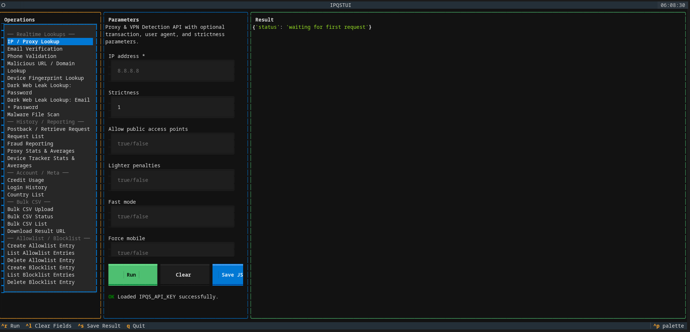

# IPQS TUI

A terminal UI for the [IPQualityScore](https://www.ipqualityscore.com) API, built with [Textual](https://textual.textualize.io).

Browse, configure, and run every public IPQS endpoint from a three-pane TUI: 
- pick an operation on the left, fill the dynamically generated form in the middle, see the JSON result on the right.

<p align="center">
  
</p>


- The intended use/goal of this project was to create a simple and minimal terminal user-interface using the `textual` library to utilize an API wrapper client for all of [IPQualityScore's](https://www.ipqualityscore.com/) awesome API functionalities.
- This includes but is not limited to:
  - Fraud prevention
  - Proxy detection
  - Tor detection
  - Email validation
  - Phone validation & Reputation API
  - Device Fingerprint API
  - Mobile Device Fingerprinting
  - Malicious URL Scanner & Domain reputation
- Includes importable Python SDK that is very simply a wrapper for the entire API using Python's `requests` library.

> ***Documentation coming soon***

---

## Features

- **All IPQS endpoints in one TUI** — realtime lookups, history/reporting, bulk CSV, allowlist/blocklist, account meta.
- **Declarative operations registry** — adding a new endpoint is a single dataclass entry.
- **Async, non-blocking** — long-running API calls execute in a worker thread; the UI stays responsive.
- **Save results to JSON** — `Ctrl+S` writes the latest result to `ipqs-result-<op>-<timestamp>.json`.
- **Safe input handling** — secret fields use `password=True`, status messages escape Rich markup, widget IDs are slugged.

---

## Requirements

- Python 3.13+
- [`uv`](https://docs.astral.sh/uv/) (package manager)
- An [IPQS API key](https://www.ipqualityscore.com/create-account)

---

## Quick start

```bash
git clone https://github.com/supasuge/IPQualityScore-TUI.git ipqs_tui
cd ipqs_tui
uv sync
export IPQS_API_KEY="your_key_here"   # or put it in a .env file
uv run python -m ipqs_tui.app # OR
source .venv/bin/acvtivate 
python -m ipqs_tui.app 
# or as specified below to install and use
uv tool install . && ipqs-tui
```

Or install as a CLI tool that's globall accessible:

```bash
uv tool install .
ipqs-tui
```

---

## Key bindings

| Key      | Action                              |
| -------- | ----------------------------------- |
| `Ctrl+R` | Run selected operation              |
| `Ctrl+L` | Clear form fields                   |
| `Ctrl+S` | Save last result to JSON file       |
| `Q`      | Quit                                |

Mouse: click an operation in the left pane, click `Run` / `Clear` / `Save JSON`.

---

## Layout

```text
┌─────────────────────────────────────────────────────────────┐
│ Header (clock)                                              │
├────────────────┬────────────────────┬───────────────────────┤
│ Operations     │ Parameters         │ Result (JSON)         │
│ (sidebar)      │ (dynamic form)     │                       │
│                │ [Run] [Clear]      │                       │
│                │ [Save JSON]        │                       │
│                │ status line        │                       │
├────────────────┴────────────────────┴───────────────────────┤
│ Footer (key bindings)                                       │
└─────────────────────────────────────────────────────────────┘
```

---

## Operations

| Category                  | Operations                                                                                                                                                                            |
| ------------------------- | ------------------------------------------------------------------------------------------------------------------------------------------------------------------------------------- |
| **Realtime Lookups**      | **IP / Proxy Lookup** · Email/Phone Verification uand Validation · Malicious URL / Domain Lookup · Device Fingerprint Lookup · Dark Web Leak (password / email+password) · Malware File Scan |
| **History / Reporting**   | Postback / Retrieve Request · Request List · Fraud Reporting · Proxy Stats & Averages · Device Tracker Stats & Averages                                                               |
| **Account / Meta**        | Credit Usage · Login History · Country List                                                                                                                                           |
| **Bulk CSV**              | Upload · Status · List · Download Result URL                                                                                                                                          |
| **Allowlist / Blocklist** | Create / List / Delete for both lists                                                                                                                                                 |

---

## Architecture

| File              | Purpose                                                                            |
| ----------------- | ---------------------------------------------------------------------------------- |
| `client.py`       | `IPQSClient` — thin HTTP wrapper around every IPQS REST endpoint                   |
| `operations.py`   | `OPERATIONS` registry — declarative list of every TUI operation with its fields    |
| `app.py`          | `IPQSTUI` — Textual app; composes the three-pane layout and wires UI to the client |
| `main.py`         | Entry-point shim                                                                   |

### `IPQSClient`

Wraps `requests.Session`. Every method maps 1:1 to an IPQS API endpoint. Raises `IPQSError` on missing keys, HTTP errors, and API-level errors (`success: false` or non-empty `errors`).

```python
from ipqs_tui.client import IPQSClient

client = IPQSClient()                          # reads IPQS_API_KEY from env
client.ip_lookup("8.8.8.8", strictness="1")
client.email_lookup("user@example.com")
client.url_lookup("https://example.com")
```

### `OPERATIONS` registry

Each `Operation` declares: a unique `key`, a `category`, a human-readable `label`, the `IPQSClient` `method_name` to call, a `description`, and a list of `FieldDef` entries (name, label, required, placeholder, default, secret).

The TUI reads this list at startup. Adding a new entry here adds a row to the sidebar and a form to the parameters pane — no UI code changes needed.

### Async flow

`Run` validates required fields synchronously, then dispatches the request to a worker thread via Textual's `@work(thread=True)` decorator. Success and error callbacks are marshalled back onto the UI thread with `call_from_thread` so the result pane and status line update without blocking input.

---

## Testing

Unit + pilot tests mock all HTTP calls and run the Textual app via `App.run_test()`:

```bash
uv run pytest                # 160+ tests, ~90s (Textual harness dominates)
uv run pytest -m integration # hits the real IPQS API; requires IPQS_API_KEY
```

The suite covers:

- `IPQSClient` — URL construction, key embedding, param filtering, error mapping, file uploads, downloads, encoding edge cases.
- `OPERATIONS` registry — uniqueness, completeness, every `method_name` resolves on `IPQSClient`.
- `IPQSTUI` logic — kwargs collection, dispatch routing, action handlers, status markup escaping, field-id slugging.
- End-to-end pilot — mounts the real app, switches operations, drives buttons and key bindings, verifies the worker round-trip.

---

## Development

In order to sync development dependencies, then run the full integration test suite:

```bash
uv sync --dev                       # install dev dependencies
uv run pytest                       # full unit suite
uv run pytest tests/test_app_pilot.py -v   # only the Textual pilot tests
```

To add a new operation:

1. Add an `Operation(...)` entry to `OPERATIONS` in `ipqs_tui/operations.py`.
2. Implement the corresponding method on `IPQSClient` (if not already present).
3. If the method has a non-keyword first argument (like `ip_lookup(ip, **params)`), add a routing branch in `IPQSTUI._invoke`.
4. Add tests in `tests/test_operations.py` and `tests/test_client.py`.

---

### Contributing

... *Instructions coming soon*


